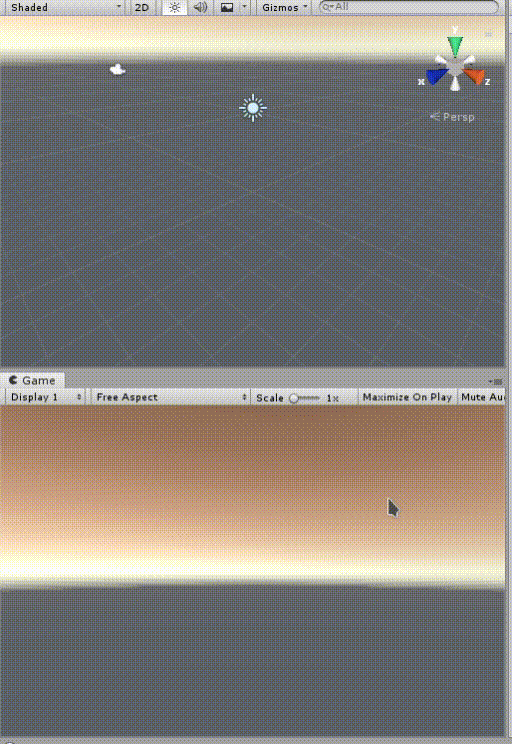

# Patrol

## 规则

+ 方向键上下左右控制人物移动
+ Q,E键分别表示向左转,向右转四分之一圆周
+ 面朝门按W键开门或关门
+ 你只能看到你所在的房间
+ 每当你经过门来到其他房间时,之前所在的房间就会消失
+ 当随机游走的胶囊走到你身边且即将要走到你所在的格子上时,你会立即死亡
+ 有时候胶囊从你身边经过但并不会立刻攻击你
+ 死亡后点击`RESTART!`按钮或者在游戏中按下空格键都可以重新开始

